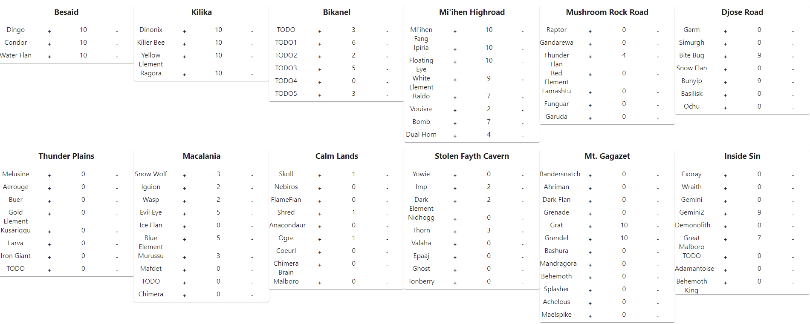

# Final Fantasy X - Monster Arena capture tracker

## Purpose

Pay no attention to this project. I just use it to keep track of how many of a certain blahblah video game lingo.

Essentially, if you have any use for this tool, then the title alone tells you exactly what this tool does.

## ...but if you do need it

1. Clone the project
2. `npm start`
3. http://localhost:3000 or whatever port your console tells you it's hosted on

## TODO
 - fill in missing monster names
 - find out if the gap between, for example, Besaid and Thunder Plains can be closed with some clever use of the Grid components
 - highlight the + and - buttons a bit better
 - highlight green for completed captures (10)
 - clamp values to 0..10
